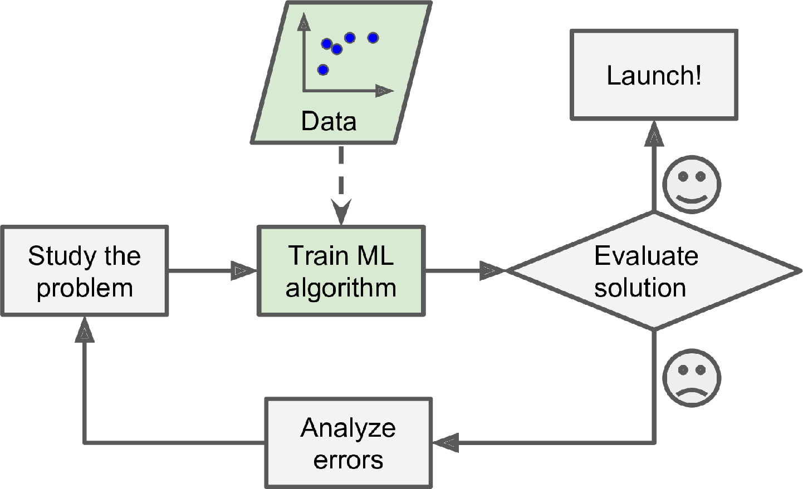
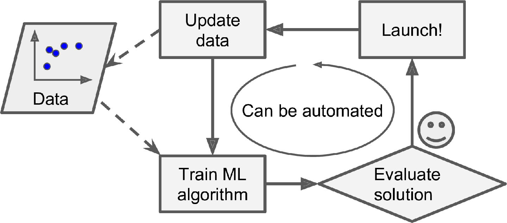

# 1 What is Machine Learning?

ML is the science (and art) of programming computers so they can learn from data.

+   **a slightly more generally definition**:

    ML is the filed of study that gives computers the ability to learn without being explicitly programmed.

+   **a more engineering-oriented** (以...为导向的/目标的) **one**:

    A computer program is said to learn from experience E with respect to some task T and some performance measure P, if its performance on T, as measured by P, improves with experience E.

    

# 2 Why use ML?

+   Problems for which existing solutions require a lot of fine-tuning or long lists of rules: one Machine Learning algorithm can often simplify code and perform better than the traditional approach.

+   Complex problems for which using a traditional approach yields no good solution: the best Machine Learning techniques can perhaps find a solution.

+   Fluctuating environments: a Machine Learning system can adapt to new data.

+   Getting insights about complex problems and large amounts of data.

The traditional approach
      

The ML approach

Automatically adapting to change

ML can help humans learn

 
# 3 Types of ML systems

-   Whether or not they are trained with human supervision (supervised, unsupervised, semisupervised, and Reinforcement Learning).
-   Whether or not they can learn incrementally on the fly (online versus batch learning)
-   Whether they work by simply comparing new data points to known data points, or instead by detecting patterns in the training data and building a predictive model, much like scientists do (instance-based versus model-based learning)

## 3.1 Supervised/Unsupervised Learning

Machine Learning systems can be classified according to the amount and type of supervision they get during training.

### 3.1.1 Supervised Learning

The training set you feed to the algorithm includes the desired solutions, called *labels*.

- classification
- regression

**Note that some regression algorithms can be used for classification as well, and vice versa** (e.g.,  *Logistic Regression* is commonly used for classification, outputing a value that corresponds to the probability of belonging to a given class.

### 3.1.2 Unsupervised Learning

The training set is unlabeled.
    

Dataset for Unsupervised Learning

-   Clustering: detect groups
    -   K-Means
    -   DBSCAN
    -   Hierarchical Cluster Analysis (HCA): may also subdivide each group into smaller groups
-   Anomaly detection and novelty detection
    -   One-class SVM
    -   Isolation Forest
-   Visualization and dimensionality reduction
    -   Principal Component Analysis (PCA)
    -   Kernel PCA
    -   Locally Linear Embedding (LLE)
    -   t-Distributed Stochastic Neighbor Embedding (t-SNE)
-   Association rule learning
    -   Apriori
    -   Eclat
-   **Notes**
    -   *Visualization algorithms*: output a 2D or 3D representation of your data that can easily be plotted. These algorithms try to preserve as much structure as they can (e.g., trying to keep separate clusters in the input space from overlapping in the visualization) so that you can understand how the data is organized and perhaps identify unsuspected patterns.
    -   *dimensionality reduction*: simplify the data without losing too much information. One way to do this is to merge several correlated features into one, called *feature exraction*.
    -   *anomaly detection*: The system is shown mostly normal instances during training, so it learns to recognize them; then, when it sees a new instance, it can tell whether it looks like a normal one or whether it is likely an anomaly.
    -   *novelty detection*: aims to detect new instances that look different from all instances in the training set. This requires having a very “clean” training set, devoid of (缺乏) any instance that you would like the algorithm to detect.
    -   *association rule learning*: dig into large amounts of data and discover interesting relations between attributes.

### 3.1.3 Semi-supervised Learning

There has plenty of unlabeled instances, and few labeled instances. Some algorithms can deal with data that’s partially labeled. This is called *semisupervised learning*.

Semisupervised learning with two classes (triangles and squares): the unlabeled examples (circles) help classify a new instance (the cross) into the triangle class rather than the square class, even though it is closer to the labeled squares

**Most semisupervised learning algorithms are combinations of unsupervised and supervised algorithms**. For example, *deep belief networks* (DBNs) are based on unsupervised components called *restricted Boltzmann machines* (RBMs) stacked on top of one another. RBMs are trained sequentially in an unsupervised manner, and then the whole system is fine-tuned using supervised learning techniques.
    

### 3.1.4 Reinforcement Learning

The learning system, called an *agent* in this context, can observe the environment, select and perform actions, and get *rewards* in return (or *penalties*). It must then learn by itself what is the best strategy, called a *policy*, to get the most reward over time.

A policy defines what action the agent should choose when it is in a given situation.

Reinforcement Learning

## 3.2 Batch and Online Learning

Another criterion used to classify Machine Learning systems is whether or not the system can learn incrementally from a stream of incoming data.

### 3.2.1 Batch Learning

In *batch learning*, the system is **incapable of learning incrementally**: it must be trained **using all the available data** (generally takes a lot of time and computing resources, and is typically done offline).  the system is trained, and then it is launched into production and runs without learning anymore; it just applies what it has learned. This is called *offline learning*.

